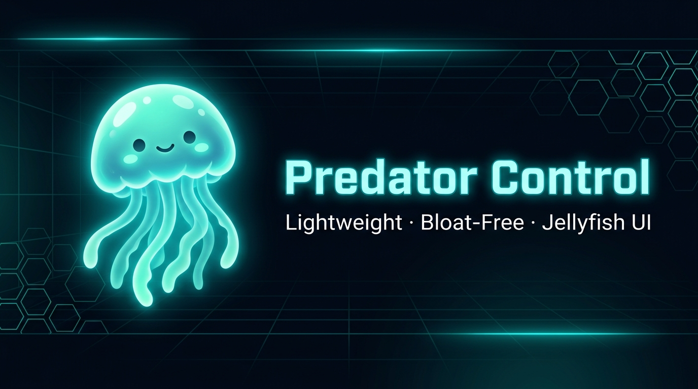
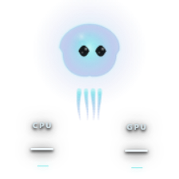
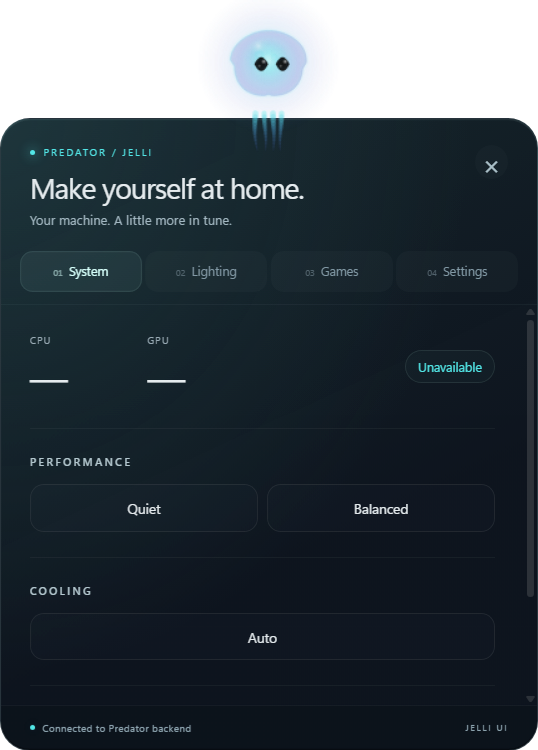
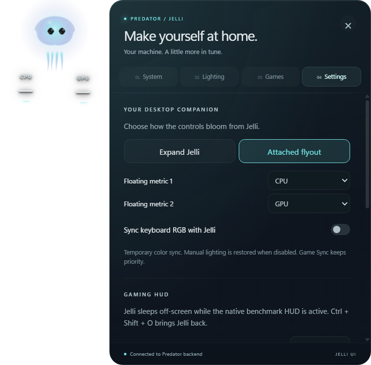
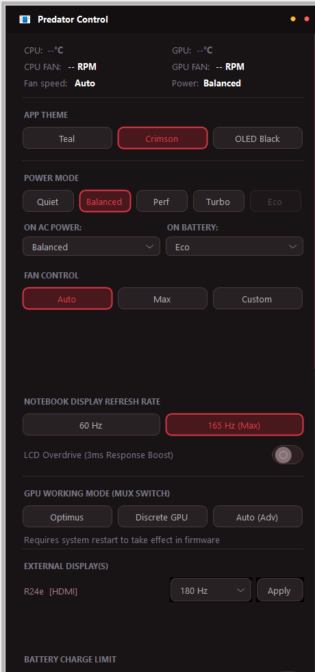
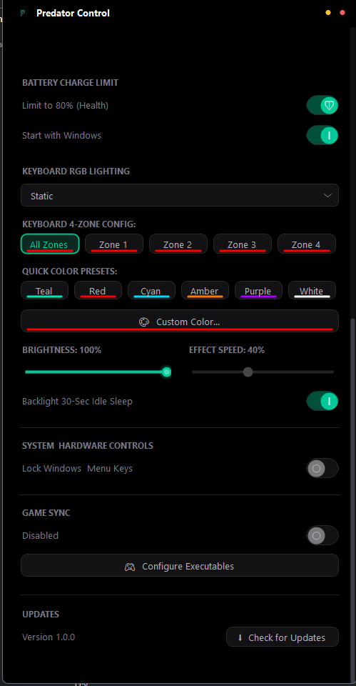

<div align="center">



# 🪼 Predator Control

[](https://github.com/YS47/PredatorControl/releases)
[](docs/jelli-architecture.md)
[](https://github.com/Hadisovic/PredatorControl)
[](https://dotnet.microsoft.com/)
[](LICENSE)
[](#-the-4-essential-acer-services)

<br/>

**Predator Control** is a lightweight PredatorSense alternative intended for compatible Acer laptops using the PredatorSense hardware/service stack. Compatibility depends on the model; hardware features vary, and only tested configurations should be considered verified.

The `jelli` branch adds the real Jelli desktop creature and React control surface around the existing C# hardware backend. See the [engineering notes and outstanding release gates](docs/jelli-architecture.md).

</div>

---

### 🪼 The Jelli desktop

<div align="center">
  
  <p>Small company. Everything within reach.</p>
  <table>
    <tr><td align="center"><b>Control center</b></td><td align="center"><b>Attached flyout & preferences</b></td></tr>
    <tr>
      <td></td>
      <td></td>
    </tr>
  </table>
</div>

Screenshots above are captured from the real packaged WebView renderer in the hardware-free validation host. Dashes and “Unavailable” are intentional: this fixture does not read sensors or issue hardware commands. The production app fills the same controls from the laptop's backend. PNG backgrounds are transparent; available controls vary by hardware.

<details>
<summary>Native fallback and gaming HUD</summary>

These are the retained native interfaces, not the default Jelli dashboard.





</details>

---

## Jelli UI

Jelli is the desktop launcher, telemetry glance surface and anchor for Predator Control. Its independent personality is preserved: temperatures, fan states and performance modes do **not** change its moods. No AI/chat/model/provider functionality is included.

- Drag Jelli to position it. Two configurable readouts float beneath it without cards or boxes, each moving on its own gentle rhythm. Text shadows keep them legible over the desktop.
- Click for a quick summary; double click for the full dashboard; right click for quick controls. Escape collapses the panel.
- Choose **Expand Jelli** (default) or **Attached flyout** in Settings. Panels ease into view, tabs reveal their contents in a short stagger, and the close button softly collapses the panel. Controls have hover, press, selection and keyboard-focus feedback. Windows reduced-motion preferences disable these decorative transitions and metric drift.
- System contains power profiles, fans, GPU, displays, battery and hardware controls. Lighting contains effects, zones, colors and brightness. Games contains Game Sync and the native gaming HUD.
- Optional **Sync keyboard RGB with Jelli** is off by default, rate-limited, and preserves the manual lighting preferences.
- **Ctrl + Shift + O** replaces Jelli with the native, always click-through ETW gaming HUD. Toggle again to restore Jelli. Choose the HUD monitor/corner and optional metric groups in Settings.
- Precise fan curves, Game Sync profile editing and update/reboot dialogs retain their native implementations during migration. **Settings → Open native fallback controls** provides the full previous interface.

The existing hardware/service logic and telemetry calculations are preserved. This branch is not a claim of universal Acer compatibility or completed physical-hardware validation.

### Resource budget

The new UI uses WebView2, so the previous native-only 40 MB claim does not describe this branch. Drawing is capped at 60 Hz, telemetry snapshots at 1 Hz, cursor snapshots at about 31 Hz, and keyboard sync at at most 1.33 Hz. Gaming suspends the WebView. The production frontend is about 225 KB of JavaScript before compression and uses React/React DOM only.

**The full application's below-200 MB idle requirement remains a release gate.** The isolated UI smoke test measured approximately 112 MiB private working set and 159 MiB private bytes in one run; those numbers exclude the real hardware backend. [Measurement details, limitations and test checklist](docs/jelli-architecture.md#performance-status-and-release-gates).

---

## 🛡️ The 4 Essential Acer Services

Predator Control replaces the heavy PredatorSense Electron frontend while smartly coexisting with Acer's hardware layer. The existing hardware/service integration keeps **4 essential Acer services** running:

| Service | Display Name | Why It Is Essential |
| :--- | :--- | :--- |
| **`AASSvc`** | **Acer Agent Service** | Direct Named Pipe (`\\.\pipe\AcerAgentPipe`) for real-time fan RPM tachometers, GPU MUX switching, and fast RGB packet serialization. |
| **`AcerLightingService`** | **Acer Lighting Service** | Controls keyboard 4-zone lighting profiles and firmware color latching (prevents annoying Amber light reset on reboot). |
| **`AcerHardwareService`** / **`AcerServiceSvc`** | **Acer Service Component** | Handles low-level APGe hardware actions (30-second keyboard backlight idle sleep timeout, power profile TDP switches). |
| **`AcerDeviceEnablingServiceV2`** | **Acer Device Enabling Service V2** | ACPI device driver bridge communicating directly with the Embedded Controller (EC). |

### 🧹 What Gets Disabled? (Bloatware & Telemetry Silenced)
Predator Control automatically detects and disables **6 intrusive, duplicate background services**:
- ❌ **`AcerCCAgentSvis`** (Acer Care Center — Telemetry, update nagware, background RAM hog)
- ❌ **`AcerQAAgentSvis`** (Acer Quick Access — Legacy popups & slow OSD)
- ❌ **`AcerDIAgentSvis`** (Acer Device Info — Periodic cloud telemetry uploads)
- ❌ **`ASMSvc`** (Acer System Monitor Service — Duplicate sensor polling causing CPU wakeups)
- ❌ Intrusive Acer startup tasks and background analytics

You can run `disable_acer_bloatware.bat` anytime to apply this optimization with a single click, or `enable_acer_services.bat` to restore default settings.

---

## 🚀 Features Matrix

### ⚡ Performance Profiles
| Mode | ACPI Code | Description |
| :--- | :---: | :--- |
| 🤫 **Quiet** | `0x00` | Low fan ceiling, whisper acoustics, low power |
| ⚖️ **Balanced** | `0x01` | Dynamic thermal balance for everyday use |
| 🏎️ **Performance** | `0x04` | High CPU TDP / GPU TGP boost, aggressive fan curves |
| 🔥 **Turbo** | `0x05` | Maximum GPU TGP overclock + 100% full fan blast (AC only) |
| 🍃 **Eco** | `0x06` | Ultra-low power battery saver mode (DC auto-switch) |

- 🔘 **Physical Mode Button Intercept**: Cycles performance modes via low-level hardware scan codes & WMI `APGeEvent`.
- 🔌 **AC/Battery Auto-Switch**: Automatically toggles profiles when plugging in or unplugging power.

### 🌡️ Thermal Management & Fans
- 💨 **Auto Fan**: Hardware EC curve.
- 🚀 **Max Fan Override**: Instant 100% full speed cooling.
- 🎚️ **Dual Custom Fan Sliders**: Independent CPU & GPU fan sliders (0–100%).
- 📈 **Graphical Fan Curve Designer**: Interactive multi-point temperature-to-RPM editor.
- ❄️ **CoolBoost™ Toggle**: Raises thermal ceiling for emergency cooling.
- 📊 **Live Dual Tachometer**: Real-time RPM monitoring.

### 🌈 Keyboard RGB Lighting (Pulsar)
- 🎨 **9 Animated Effects**: Static, Breathing, Neon, Wave, Shifting, Zoom, Meteor, Twinkling, Off.
- 🖌️ **6 Neon Quick Presets**: Teal, Crimson, Cyan, Amber, Purple, White.
- 🎯 **4-Zone Independent RGB**: Custom per-zone colors with live neon color indicators.
- 🎭 **Full RGB Color Picker**: Custom 24-bit Hex/RGB selection.
- 💤 **30s Backlight Idle Timeout**: Auto-sleeps LEDs on inactivity.
- ⚡ **Zero-Lag Batching**: Non-blocking background worker (~30ms apply time).

### 🖥️ Hardware & Battery Controls
- 🔋 **80% Battery Charge Limiter**: Hardware register toggle to preserve battery lifespan.
- 🔒 **Windows Key Lock**: Disables Windows key during gaming.
- 🔊 **BIOS Startup Sound**: Toggle Acer Predator boot chime directly in BIOS/EC.
- ⚡ **LCD Overdrive (3ms)**: Toggles panel response time.
- 🖱️ **GPU MUX Switch**: Optimus, Discrete (NVIDIA Only), and Advanced Optimus.
- 🖥️ **Refresh Rate Switcher**: Switch internal display (60Hz ↔ 165Hz/240Hz) and external monitors via Win32 CCD API.

### 🎮 OSD & In-Game Gaming Overlay
- ⚡ **In-Game Gaming Overlay HUD (G-Helper Style)**: Real-time neon green FPS counter (powered by zero-injection Windows ETW kernel Present monitoring), CPU/GPU temperatures, fan RPMs, active GPU wattage (`0x0D`), 60-second rolling sparkline performance graph, and battery gauge. Toggle with `Ctrl + Shift + O`. Position and optional metric groups are selected in Jelli Settings; the HUD remains non-interactive during gameplay.
- 🛡️ **100% Anti-Cheat Safe**: Uses Windows ETW kernel tracing (`Microsoft-Windows-DxgKrnl` Event ID 184 / `DXGI` Event ID 42). Zero DLL injection, zero API hooking (safe with Vanguard, EAC, BattlEye, Ricochet).
- 🔑 **Dedicated Predator Key Intercept**: Low-level hardware hook (`WH_KEYBOARD_LL`) intercepting Acer scan code `0x75` (`VK_0xFF`) to toggle the app window instantly without stealing in-game focus.
- 🏎️ **High CPU Priority Enforcement**: Automatically configures Windows Registry IFEO (`CpuPriorityClass=3`), Task Scheduler `<Priority>2</Priority>`, and runtime `ProcessPriorityClass.High` (`BasePriority=13`) for zero latency and micro-stutter immunity during AAA gaming.
- 🌊 **Floating Mode OSD**: Focus-safe banner with custom neon vector emblems on profile changes.
- 🎮 **Game Sync Profiles**: Automatically binds performance, fans, and RGB to game `.exe` launches.

---

## 🏗️ Repository Structure

```
PredatorControl/
├── src/
│   ├── Form1.cs                   # Main UI, layout, and IPC handlers
│   ├── WmiController.cs           # ACPI WMI hardware driver (Power, Fans, RGB, Battery)
│   ├── PredatorKeyHook.cs         # WH_KEYBOARD_LL low-level keyboard hook
│   ├── GameOverlayForm.cs         # In-Game Gaming Overlay HUD (G-Helper style)
│   ├── EtwFpsMonitor.cs           # Kernel ETW DxgKrnl / DXGI Present FPS monitor
│   ├── OSDOverlayForm.cs          # Focus-safe floating HUD overlay
│   ├── DisplayCcdController.cs    # Win32 CCD display & refresh rate switcher
│   ├── SingleInstanceIpc.cs       # Named Pipe server & client for single-instance IPC
│   ├── TelemetryService.cs        # CPU/GPU temperature and fan RPM poller
│   ├── ThemeManager.cs            # UI Color palettes (Predator Teal, Nitro Crimson, OLED Black)
│   ├── FanCurveForm.cs            # Graphical fan curve editor
│   ├── FanCurveGraph.cs           # Fan curve interactive graph engine
│   ├── GameSyncController.cs      # Auto profile switcher on game launch
│   ├── GameSyncForm.cs            # Game sync profile management UI
│   ├── DarkScrollPanel.cs         # Custom dark scroll panel
│   ├── Updater.cs                 # In-app GitHub release updater
│   ├── SelfCheck.cs               # Self-diagnostics & environment checks
│   ├── PredatorButton.cs          # Custom WinForms controls (Buttons, Sliders, Switches, Dropdowns)
│   └── PredatorControlApp.csproj  # .NET 10.0 Windows Forms project definition
├── assets/
│   ├── banner.jpg                 # Jelli jellyfish mascot hero banner
│   ├── preview_overlay.png        # In-Game Gaming Overlay HUD preview
│   ├── preview_dashboard.png      # Dashboard, Thermals & MUX Switch preview
│   └── preview_controls.png       # RGB Lighting & System Controls preview
├── README.md                      # Project documentation
└── .gitignore                     # Git ignore rules
```

---

## 🗺️ Roadmap

- [ ] 🪼 **Jelli UI release validation**: Physical hardware parity, mixed-DPI/docking, real-game overlay behavior and full-process memory budget; see the integration notes.
- [ ] 🎮 **Raw Input HID Hook**: Native hardware Predator Key sniffing (`UsagePage 0xFFA0`)
- [ ] ⚡ **ACPI Event Sniffing**: Deep `AcerEvent` / `APGeEvent` mapping
- [ ] 🌊 **RGB Wave Direction**: Direction toggle (Left-to-Right / Right-to-Left)
- [ ] 🔋 **USB Power-Off Charging**: Direct firmware toggle
- [ ] 🩺 **Hardware Health Diagnostics**: Battery wear % & SSD S.M.A.R.T. readout

---

## ⚙️ Building from Source

### Prerequisites

- Windows 10/11 x64 and [.NET 10 SDK](https://dotnet.microsoft.com/download/dotnet/10.0).
- Node.js 24 LTS with npm, used only while building.
- [Microsoft Edge WebView2 Evergreen Runtime](https://developer.microsoft.com/microsoft-edge/webview2/), used by the application.

```powershell
git clone https://github.com/Hadisovic/PredatorControl.git
cd PredatorControl
git switch jelli
.\tools\build-jelli.ps1
```

The publish script builds and embeds the UI, then produces `artifacts/jelli/PredatorControlApp.exe`. This is a self-contained .NET executable; WebView2 Evergreen remains a prerequisite. Run `tools/build-jelli.ps1 -FrameworkDependent` if the target already has the .NET 10 Desktop Runtime. MSBuild also builds/embeds the frontend during a normal `dotnet build src/PredatorControlApp.csproj`.

### Validation without hardware writes

```powershell
npm --prefix jelli-ui test
npm --prefix jelli-ui run lint
dotnet run --project tests/PredatorControl.Jelli.Tests -c Release
```

The test executable opens the actual native WebView host with isolated test descriptors, unavailable telemetry and no hardware controller. It tests rendering, interactions, protocol/lifecycle behavior and reports memory across its owned process tree. Screenshots go to ignored `artifacts/screenshots`. It is not a physical hardware parity test.

## Launch and test the Jelli build

1. Exit any currently running PredatorControl instance through its tray. Single-instance compatibility intentionally prevents two control processes.
2. Run `artifacts/jelli/PredatorControlApp.exe` as Administrator. There is no separate frontend to start and no terminal window.
3. Test Jelli's single/double/right click and both panel modes. Configure its metrics and gaming HUD in Settings.
4. Use the [manual acceptance checklist](docs/jelli-architecture.md#manual-acceptance-checklist) before distributing or merging this branch.
5. For troubleshooting, launch with `--legacy-ui`. `--jelli-devtools` enables WebView developer tools explicitly. Native startup/tray/update behavior remains in the same application.

---

## 🧪 Controlling via Named Pipe IPC

You can interact with a running instance of Predator Control from PowerShell:

```powershell
$pipe = New-Object System.IO.Pipes.NamedPipeClientStream(".", "AcerPredatorControl_IPC_Pipe", [System.IO.Pipes.PipeDirection]::Out)
$pipe.Connect(1000)
$writer = New-Object System.IO.StreamWriter($pipe)
$writer.AutoFlush = $true

# Available commands: "SHOW" | "TOGGLE" | "CYCLE_MODE" | "EXIT"
$writer.WriteLine("TOGGLE")

$writer.Close()
$pipe.Close()
```

---

## 🛡️ Safe Bloatware Optimization

To silence Acer telemetry and bloatware without breaking hardware controls:
1. Run **`disable_acer_bloatware.bat`** as Administrator.
2. It disables the 6 telemetry daemons (`AcerCCAgentSvis`, `AcerDIAgentSvis`, `AcerQAAgentSvis`, `ASMSvc`, etc.) while safeguarding the **4 essential services** (`AASSvc`, `AcerLightingService`, etc.).
3. To restore factory Acer services at any time, run **`enable_acer_services.bat`**.

---

---

## 💡 Credits & Attribution

Jelli creature renderer: [Hadisovic/Jelli](https://github.com/Hadisovic/Jelli), revision recorded in [UPSTREAM.md](jelli-ui/UPSTREAM.md).

Special thanks and recognition to **[@supesonly](https://github.com/supesonly)** for the foundational inspiration and project base:
* [supesonly/Acer-P-Helper](https://github.com/supesonly/Acer-P-Helper)

---

<div align="center">

**Made with 🪼 and neon teal**

*Acer and PredatorSense are registered trademarks of Acer Inc. Predator Control is an independent open-source project.*

</div>
